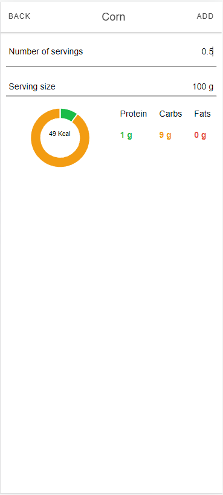

# Bachelor-Thesis

 - [Front-End](https://github.com/StefanButacu/App-Calorie-Tracking-FE)  
 - [Back-End](https://github.com/StefanButacu/App-Calorie-Tracking-BE)  
 - [Segmentation](https://github.com/StefanButacu/Food_Segmentation)  
 - Paper

## Abstract
In the current era, the regular intake of healthy food is crucial for maintaining a balanced diet to overcome obesity in humans. Automated food recognition in images holds an array of compelling applications, such as nutritional tracking within medical cohorts. This study suggests a deep learning model neural network that classifies each pixel in an image into one food category out of the 103 available categories. The primary objective of this proposed methodology is to deliver exceptional performance as per established evaluation metrics in the field of image segmentation.
 
Additionally, the user-friendly graphical interface of the application encourages users to adhere to their dietary plans and maintain a consistent record of their daily eating habits. This engaging interface design plays a significant role in facilitating user retention and promoting regular interaction with the system.
## Presentation
<table>
  <tr>
    <td align="center"> Login</td>
    <td align="center"> Register</td>
    <td align="center"> My Profile</td>
  </tr>
  <tr>
    <td align="center"> Diary Day</td>
    <td align="center"> Listing Food</td>
    <td align="center"> Prediction</td>
  </tr>
   <tr>
    <td align="center"> Adding Food</td>
 </tr>
</table>

  
## References 
 - [SamEncoder] (https://github.com/facebookresearch/segment-anything)
 - [Dataset](https://github.com/LARC-CMU-SMU/FoodSeg103-Benchmark-v1)  
